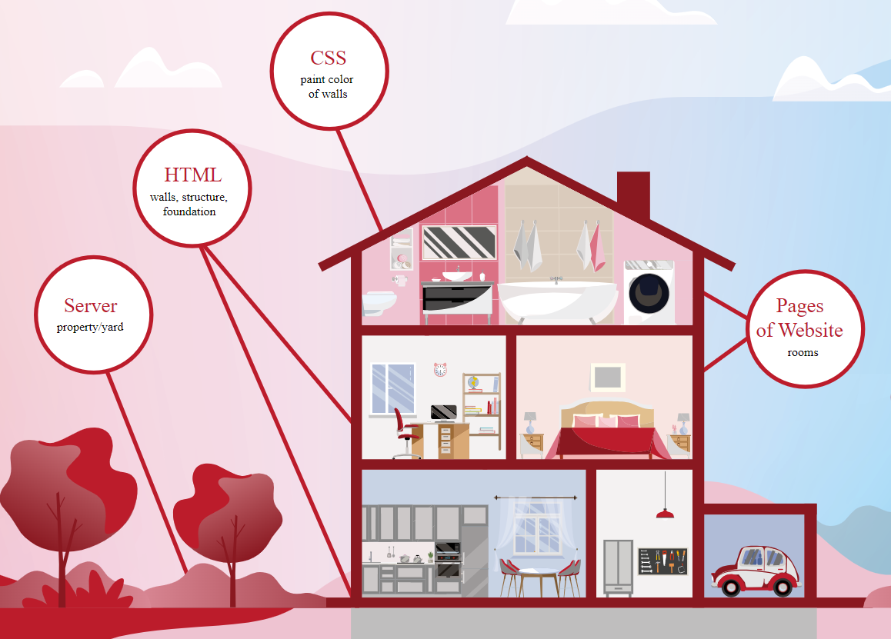

# What is Web Development?
{: .no_toc }

## Table of contents
{: .no_toc .text-delta }

1. TOC
{:toc}

---

{: .attention }
The starter kit goes over the surface level of web development. It is a very high-level perspective and there's so much more going on under the cover. Take each explanation with a grain of salt as it's meant to introduce you to these ideas.

## Internet and Web Development
The Internet is like a huge worldwide network that connects millions of devices together. It's a bit like a massive library, but instead of books, it stores information, pictures, videos, and much more. You can think of it as a place where people from all over the world can share and access information.

Websites are like individual rooms or spaces in this big library. Each website has its own unique address, just like a house has an address in a city. When you visit a website, you're exploring what's inside that particular room of the internet library. Websites can be about anything – from sharing news and stories, selling products, teaching things, or simply entertaining people.

Now, web development is the fascinating process of building these websites. It's like being an architect, designer, and storyteller all at once. People who work on web development use special computer languages and tools to create and design these online spaces.

## Components of Web Development
Making a website usually consists of several teams, kind of how architects, engineers, and workers come together to build a house. When we create cool websites, there are three main groups involved:
- Design
- Frontend
- Backend

Let's check out what they do!

### 🏠 The Design Team
The design team are like the architects who draw the creative blueprints for the house. They focus on how the house will look and feel, deciding on the colors, layout, and style. Similarly, in web development, the design team plans how the website will appear to visitors. They choose the colors, shapes, and where things like buttons and pictures will go, making the website look fantastic!

### 💻 The Frontend Team
The frontend team is similar to the construction workers who build the visible parts of the house that people see and interact with—like the walls, doors, and windows. In web development, the frontend team uses special programming languages like HTML, CSS, and JavaScript to create what you see on a website. They make sure the website looks great on your computer or phone, just like how builders make sure the house looks amazing from the outside.

### 🔧 The Backend Team
Now, the backend team is like the engineers and the house's hidden systems—things you might not see, like the electricity and plumbing. In web development, the backend team works on the website's power system, the databases, and other technical stuff. They make sure everything works smoothly behind the scenes, so when you click a button, the right information shows up, just like when you turn on a light switch, the light comes on without you seeing all the wiring.

[Back to Home]({{ "/" | relative_url }}){: .float-left .v-align-text-top}
[Next: Design](Web Development Concepts/Design){: .float-right .v-align-text-top}

